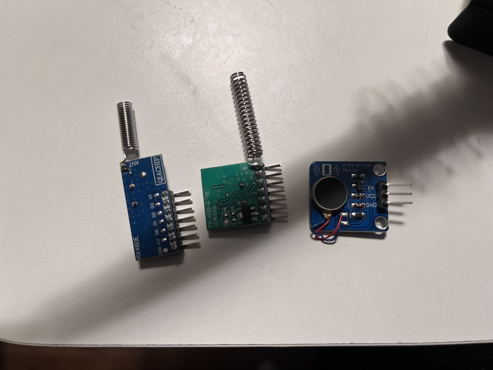
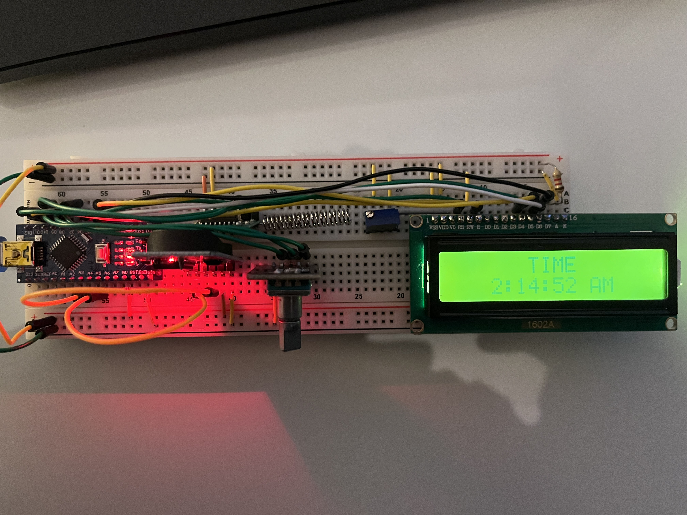
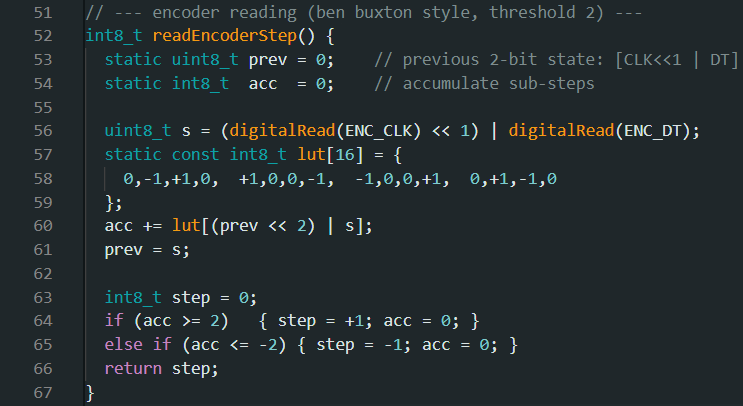
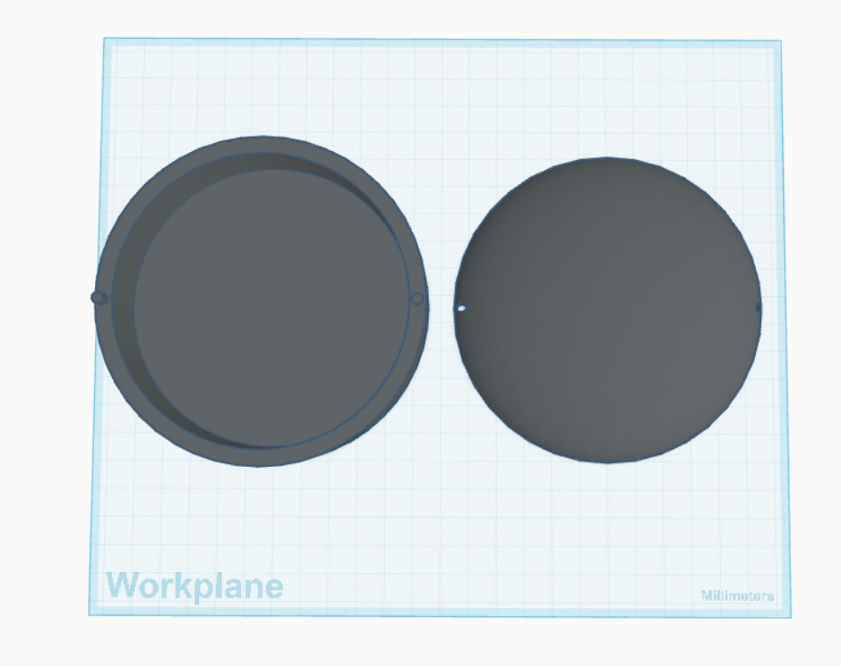
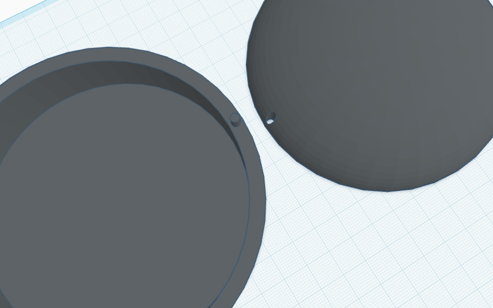
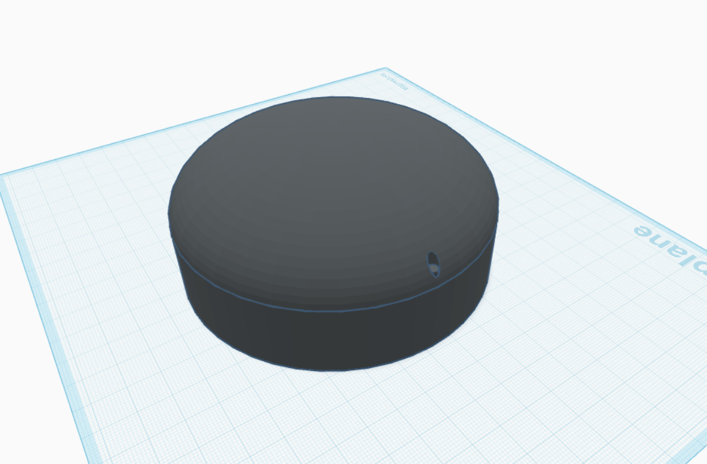
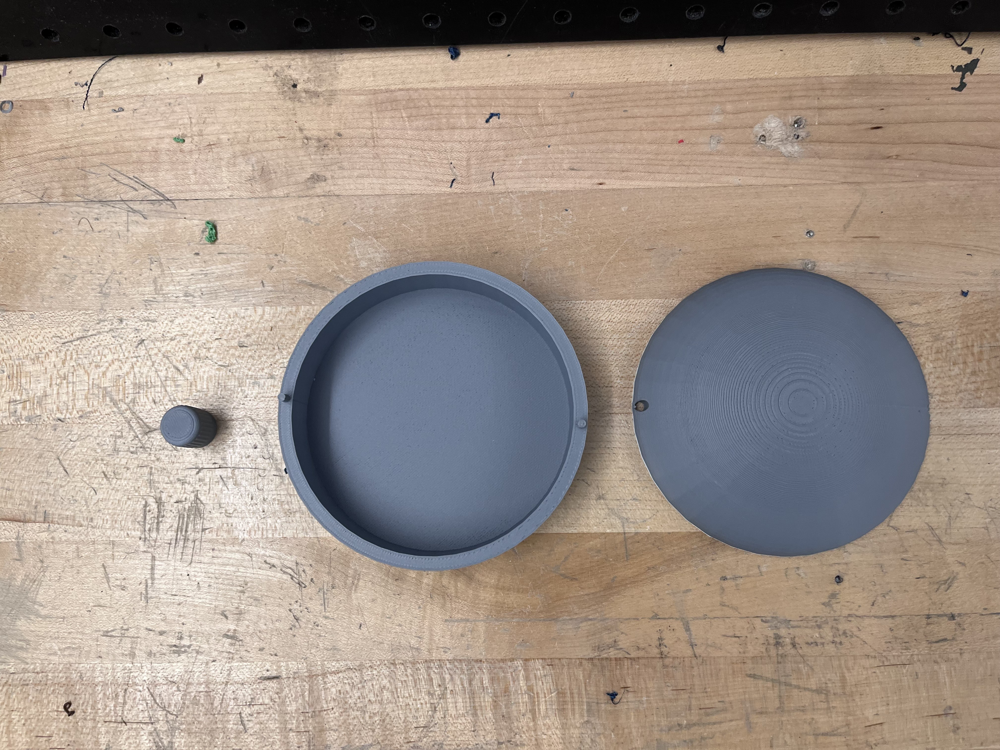
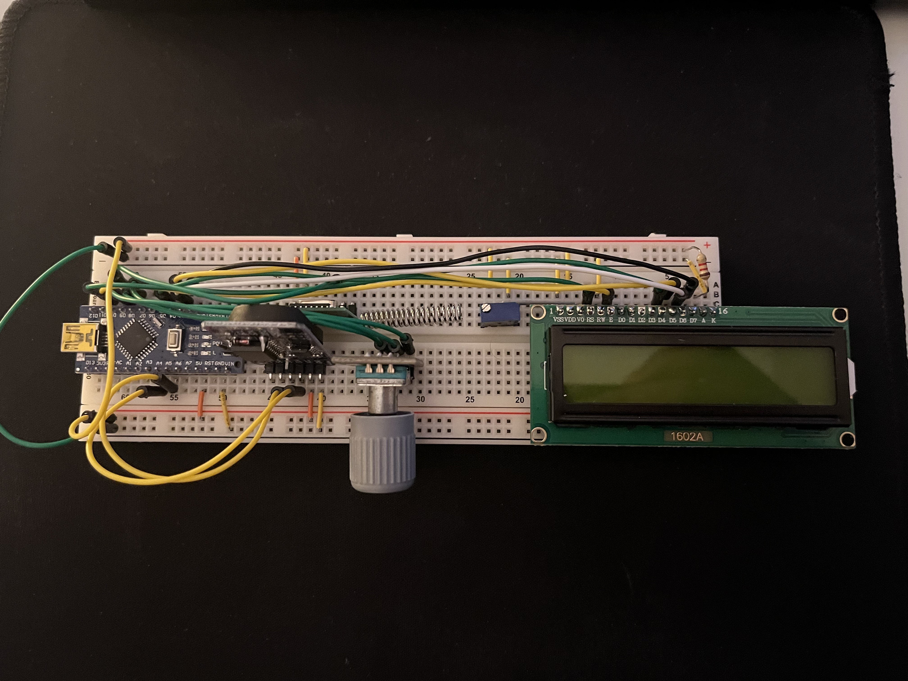
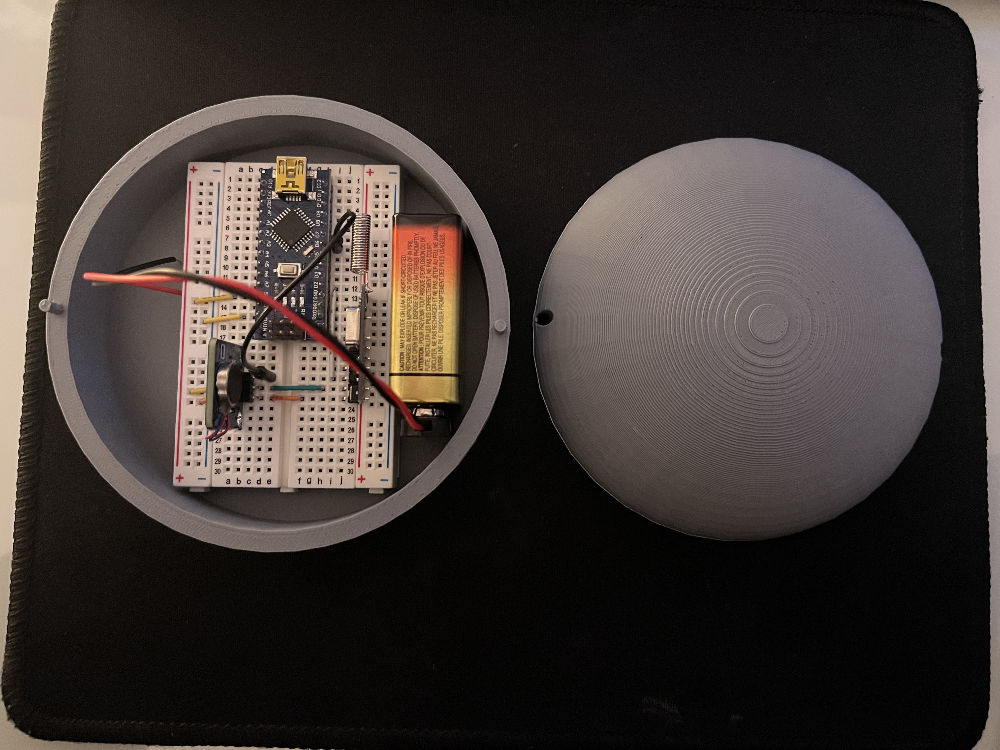

# Vibrating Alarm Clock

Made a vibrating alarm because a normal alarm woke up everybody other than me.

## How It Was Made

### Section 1: Background

In my house, I'm a notoriously heavy sleeper. If I need to wake up at 7:00 AM, I end up setting alarms every five minutes from 6:00 AM till 7:00 AM. As you can probably imagine, that routine isn't very popular at home. More often than not, my family, who were already awake from the constant alarms, wind up waking me themselves. Ironically though, the light shake or the few taps they give me, wake me faster than the hour of alarms. Eventually I figured that a vibrating alarm was the answer. But most models I found online had the vibration component connected to the base via a cable, which wasn't ideal for me, so I decided to built my own.

---

### Section 2: Design Rationale & Components

I set out to build a two-part system: a base unit and a vibrating module. To avoid an annoying wire between them, they’d communicate wirelessly. The base would display the current time and provide a simple way to set the alarm. To do this, I needed a few things. First, microcontrollers, one for the base and one for the vibrating unit, to run the logic. The base needed an LCD to display the time (luckily my brother had a spare), and a real-time clock to keep accurate time. I decided to use a rotary encoder to handle the alarm time input (thank you Umair for giving me one :D). I used a 433 MHz RF module to handle the wireless communication between the two units. Finally, I needed a vibration motor so that the vibration unit would actually vibrate.

Part List: 
[MCUs](https://www.amazon.ca/dp/B0D5LYFRQP?ref=ppx_yo2ov_dt_b_fed_asin_title) 
[LCD](https://www.amazon.ca/LCD1602-Module-Character-Display-Module-1602/dp/B08F7LWZ4T/ref=sr_1_23?crid=3RP3GGL7BA8YR&dib=eyJ2IjoiMSJ9.IdVJNAx9m1D0Ur3dlsvlSvP8dFwJgHff0sC7ulqJMDXUmWe8z4aqNpao4vS5VKFLE8eszzuyhULJpblaVCawimsJB1YKqT5qj7pUnBLylsP9gOmVXlVNER0hPj8NbWIw33R0zspSOyHDH6ptqq9weY0cFGDbxYjDBCQw86P-wpil7hJ55i1ucOJL_GoTi2PQlGVzFGuA25y1NpuCK_Xz5GS5dY_V_LzQ8Zb26ctn8bzkFovRkjwAxBVJZgudlJ_5x-tlRqGNCEslSoT_1nEQTI54MCcvQZfeSzx6az7_9jU.6jrsxPjdZ9UShooUcSCDlXbn9BB-BUiVXqJ1AwSkNZg&dib_tag=se&keywords=1602%2Blcd%2Bgreen&qid=1762664043&s=electronics&sprefix=1602%2Blcd%2Bgreen%2Celectronics%2C128&sr=1-23&th=1) 
[RTC](https://www.amazon.ca/dp/B09V26J3VQ?ref=ppx_yo2ov_dt_b_fed_asin_title) 
[Rotary Encoder](https://www.amazon.ca/dp/B0C2CLW37J?ref=ppx_yo2ov_dt_b_fed_asin_title) 
[RF Module](https://www.amazon.ca/dp/B08SQDVY99?ref=ppx_yo2ov_dt_b_fed_asin_title) 
[Vibration Motor](https://www.amazon.ca/dp/B08GS1TYY4?ref=ppx_yo2ov_dt_b_fed_asin_title) 

Considering the parts I actually used, the total cost was ~$48.

---

### Section 3: Build Process

After the parts arrived, my first task was soldering header pins onto the vibration motor and antennas onto the 433 MHz RF transmitter and receiver. I didn’t have a soldering kit, so thanks to Umair (again) for letting me use his and helping with the joints. Here is how they came out: 

Next I connected the components for the base on a breadboard (ignore the time, I know I should get more sleep): 

Then I did the same for the vibration module: 

---

### Section 4: Code

The MCUs I used were compatible with the Arduino IDE, so that is what I used to program them. The code for the vibration unit, titled “pillow_rx” (it lives under my pillow), was very straightforward and quick to complete. For now, I have made it so that when the alarm goes off, it pulses vibrations periodically for 30 seconds; however, this can be easily modified by changing just a couple of lines. The code for the base was a little more time-consuming, as I had to learn how to program components I had never used before. In particular I had an issue with the rotary encoder; if I spun it too fast, it would decrease the time when it should have been increasing it, and vice versa. Here is the section of code associated with that part: 

I used a small lookup table (LUT) to map each state transition to a direction. First the previous 2-bit state is compared to the new one, a valid forward tick (e.g., 00 -> 10) returns +1, a valid backward tick (e.g., 00 -> 01) returns −1. If there’s a noisy jump (e.g., 00→11, notice both bits change), it returns 0. That way the value doesn’t randomly increase/decrease when I’m clearly turning up/down.

---

### Section 5: Case Design

The final thing I needed to do was make a case for the vibration unit because otherwise my head would probably crush all the components. I used TinkerCAD to model a very basic cylinderal case with a rounded lid: 

I added holes in the lid and size-matched pins on the base, these make it so the lid and base don't slide off of eachother: 

This is how they would fit in together: 

I used my university's 3D printer to print the parts, this is how they came out (I also printed a knob for the rotary encoder, but this isn't my design): 

---

### Section 6: Final Build

This is how the final base came out: 

This how the final vibration unit came out: 

Here is a Demo of the final design: https://youtube.com/shorts/0Ov2enDjrLM

---

## Final Thoughts

Overall, I’m very happy with the build. I’ve been testing it for the past couple of nights, and it’s woken me up pretty consistently. I’m still going to play around with the alarm duration and vibration pattern to see if I can make it more effective though.  In the future, I’d like to turn the base circuit into a PCB and design a proper case, but for now this setup works just fine.
